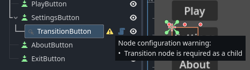
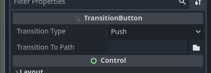
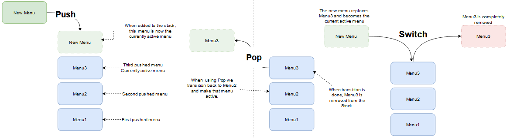

# Menusystem addon for Godot

With nodes added to a normal button in Godot (BaseButton) we can easily create 
transitions between different menus. 

## Main concepts 
Start by building a main menu as you normally would. With Control-nodes and Button-nodes. 

`MenySystem` uses these buttons to know when to transition by connecting to 
the buttons `Pressed` signals. The button may be any kind of button that 
derives from `BaseButton`.

### TransitionButton
To the button you want to add a transition to another menu, add 
a `TransitionButton` as a child.

The `TransitionButton` is responsible for connecting to your buttons pressed signal
and holding the settings for the transition. Some settings on the node it
self, as exports, and some as children.

#### Settings

**Transition Type**:
You may choose from, Push; Pop and Switch.
The menus are structured and processed with a `Stackable State Machine`. And in true
`Stack` fashion, Stack adds your menu to the pile and Pop removes it from the pile. Switch
replaces the current menu (at the top of the pile) to the new menu.

**Transition To Path**
Here you enter the path to the menu to transition to. 

	Note: Transitiontype Pop ignores this path.

### Transition from the main menu to settings.
### Fade out and exit

When we press `Exit` button we want to fade out and exit the game.

To 
