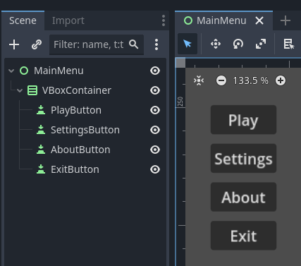
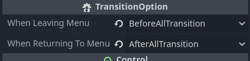
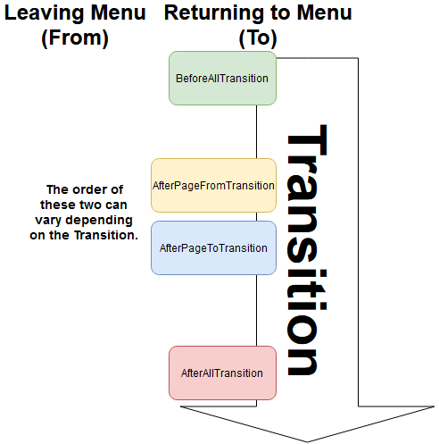
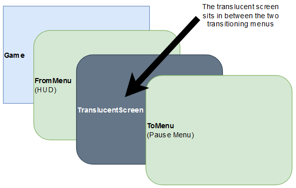
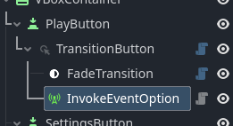
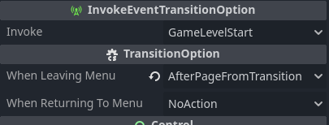

# Menusystem addon for Godot

**Create transitions between your menu-scenes with ease.**

With nodes added to a normal button in Godot (BaseButton) we can easily create transitions between different menus. 

This addon for Godot is written i C#

The demofiles referred to in this documentation can be found in the 
`documentation/scenes` folder.

## Table of Content
- [Menusystem addon for Godot](#menusystem-addon-for-godot)
  - [Table of Content](#table-of-content)
  - [Install](#install)
  - [Main concepts](#main-concepts)
    - [TransitionButton](#transitionbutton)
      - [Settings](#settings)
    - [Transitions](#transitions)
      - [InstantTransition](#instanttransition)
      - [FadeTransition](#fadetransition)
      - [MoveTransition](#movetransition)
    - [Option-nodes](#option-nodes)
      - [PauseGameTransitionOption](#pausegametransitionoption)
      - [QuitGameTransitionOption](#quitgametransitionoption)
      - [TranslucentScreenTransitionOption](#translucentscreentransitionoption)
      - [InvokeEventOption](#invokeeventoption)
      - [TestPrintOption](#testprintoption)
      - [DisableMenuOption](#disablemenuoption)
  - [Build a basic game menu](#build-a-basic-game-menu)
    - [Have MainMenu display at start](#have-mainmenu-display-at-start)
    - [Transition from the main menu to settings.](#transition-from-the-main-menu-to-settings)
    - [Transition back to the main menu](#transition-back-to-the-main-menu)
    - [Fade out and exit](#fade-out-and-exit)
    - [Fade out and in to GamePlay](#fade-out-and-in-to-gameplay)
      - [Start a GameLevel in the background](#start-a-gamelevel-in-the-background)
    - [Fade back to MainMenu from GamePlay](#fade-back-to-mainmenu-from-gameplay)
      - [Game is not paused](#game-is-not-paused)
      - [HUD should stay in place](#hud-should-stay-in-place)
      - [Fade the background](#fade-the-background)
    - [Resume the game](#resume-the-game)
    - [Settings and About](#settings-and-about)

## Install
1. Download the folder `addons/menusystem`
2. Place it in your `addons` folder of your project
3. Enable the plugin in `Project` -> `Project Settings...` -> `Plugins`

## Main concepts 
When using `MenuSystem` you start by building a main menu as you normally 
would. With Control-nodes and Button-nodes. 



`MenuSystem` uses these buttons to know when to transition by connecting to 
the buttons `Pressed` signals. The button may be of any kind of button that 
derives from `BaseButton`. `TransitonButton`, se below, gives these buttons 
extra functionality. 

Globaly, as a autoload/singleton, we have the `MenuController`. 
The `MenuController` supervises all menutransitions, and keep track of all
active menus behind the scene.

### TransitionButton
To the button you want to add a transition to another menu, add 
a `TransitionButton` as a child.


The `TransitionButton` is responsible for connecting to your buttons pressed signal
and holding the settings for the transition. Some settings on the node it
self, as exports, and some as children.

#### Settings


**Transition Type**:
You may choose from, Push; Pop and Switch.
The menus are structured and processed with a `Stackable State Machine`. And in true
`Stack` fashion, Stack adds your menu to the pile and Pop removes it from the pile. Switch
replaces the current menu (at the top of the pile) to the new menu.


**Transition To Path**
Here you enter the path to the menu to transition to. 

	Note: Transitiontype Pop ignores this path.

### Transitions
There are a few built in transitions. 
- InstantTransition
- MoveTransition
- FadeTransition

#### InstantTransition
Instantly transition to the new menu

#### FadeTransition
The screen fades to black, and then fades back to reveal the new menu

- Fade Type: Indicates if you want to fade out, fade in or both. 
- Transition Time: The time, in seconds, ___each___ fade-transition takes. 

#### MoveTransition
The menus moves in a set direction in/out of the screen


- Move Direction: The  direction both menus move over the screen
- Transition Time: The time, in seconds, the full transition takes
- Transition Type and Ease Type: Refer to Godot Tweening CheatSheet

https://raw.githubusercontent.com/godotengine/godot-docs/master/img/tween_cheatsheet.webp

### Option-nodes
Sometimes you need some extra functionality in your transitions, for this we have some 
`TransitionOption`-nodes. 

The built in `TransitionOption`-nodes
-  PauseGameTransitionOption
-  QuitGameTransitionOption
-  TranslucentScreenTransitionOption
-  InvokeEventOption
-  TestPrintOption
-  DisableMenuOption



TransitionOption-nodes can be invoked two times. 
1. When the user presses the connected button
1. When returning back to the menu

This usually means it sets a value when you press the button, and unset this value when 
you return back to the menu. 

You have the option to choose when the action is to take place during the transition. The two
easiest option to understand are probably `BeforeAllTransition` and `AfterAllTransition`. They are,
as the name implies, invoked before any transition takes place or after all transition have taken
place. 


`AfterPageFromTransition` and `AfterPageToTransition` are invoked when the transition of the menu we are leaving or the menu we are returning to, respectivly, are finished. 

    Note: When we press the button to go back (using Pop as Transition-type), that current
    menu is the 'From'-menu and the menu we are going back to is the 'To'-menu. 

    Note: If you don't want an action to take place choose: 'No Action'

#### PauseGameTransitionOption


`When Leaving Menu`: The game is paused.

`When Returning To Menu`: The game is unpaused

#### QuitGameTransitionOption


`When Leaving Menu`: Exits the game

`When Returning To Menu`: Does nothing, we're not coming back here

#### TranslucentScreenTransitionOption




`Translucent Level`: Sets how translucent the screen is. This directly affects the alpha of the screen. 

`Fade Time`: The time, in seconds, the fading should take

`When Leaving Menu`: Fades the screen to set value of `Translucent Level`

`When Returning To Menu`: Fades the screen back to full transparancy

#### InvokeEventOption


`Invoke`: The event to be invoked. (GameLevelStart, GameLevelEnd, GamePaused, GameResumed)
In your code you can subscribe to these event as follows:
```csharp
    public override void _Ready()
    {
        // Subscribe to when the GameLevelStart
        MenuEvents.OnGameLevelStart += GameStart;
    }

    public override void _ExitTree()
    {
        // UnSubscribe to when the GameLevelStart
        MenuEvents.OnGameLevelStart -= GameStart;
    }

    private void GameStart()
    {
        PackedScene gameLevel = GD.Load<PackedScene>("res://Documentation/Scenes/GameLevel.tscn");
        Node2D gameInst = gameLevel.Instantiate<Node2D>();
        AddChild(gameInst);
    }
```

`When Leaving Menu`: Invokes set event

`When Returning To Menu`: Invokes set event

#### TestPrintOption


This node is basically a "print-debug"-node 

`When Leaving Menu`: Prints the path of the node

`When Returning To Menu`: Prints the path of the node

#### DisableMenuOption


This  option-node works a bit different. It disables all movement of the menu we are leaving. 
Usefull for when you still want to see the menu in the background. 

## Build a basic game menu
### Have MainMenu display at start
In the `_Ready()` of your start scene:
```csharp
PackedScene packedScene = GD.Load<PackedScene>("res://Documentation/Scenes/MainMenu.tscn");
MenuController.Instance.SetInitialMenu(packedScene);
```

### Transition from the main menu to settings.
1. To the `SettingsButton`, add a `TransitionButton` as a child.
1. Have the transition-type remain at `Push`
1. And set the `Transition to path` to point to the settings scene

    
1. As a child to `TransitionButton` add a `MoveTransition`-node

    
1. Set `Move direction` to `Left`
1. Keep the default on the rest of the properties.

When you now press `Settings` the current menu moves left of the screen. And at the same
time the `Settings` menu enters from the right. (moving left)

	Note: AboutButton have the same nodes and settings, apart from 
	"Transition to Path" that should point to the About-scene.

### Transition back to the main menu
After we moved to the Settings-menu, `MenuController` have a stack of Menus:
- Settings (Currently active)
- MainMenu 

To go back to the MainMenu we have to use `Pop` as a `TransitionType`. This removes
the top menu (Settings menu) and makes the next menu active (MainMenu).


1. To the `GoBackButton` (Normal button renamed to 'GoBackButton'), add a `TransitionButton` as a child
1. Set the transition-type to `Pop`
1. Leave the `Transition to path` blank. (MenuController already knows where to go)
1. As a child to `TransitionButton` add a `MoveTransition`-node
1. Set `Move direction` to `Right`
1. Keep the default on the rest of the properties 

Note:
	
	The most important setting is the Transition Type to be set to Pop

	The About menu is the same as Settings menu
	
### Fade out and exit

When we press `Exit` button we want to fade out and exit the game.

1. To the `ExitButton`, add a `TransitionButton` as a child
1. The settings of the `TransitionButton` may remain at the default
1. As a child to `TransitionButton` add a `FadeTransition`-node

	
1. Set `Fade Type` to only `Out`

	
1. Leave `Transition Time` at default

	This only fades out and stays at black. To exit the application we need to add a another
	node, `QuitGameTransitionOption`-node.

1. As a child to `TransitionButton` add a `QuitGameTransitionOption`-node
	

When we now run the game and press the `ExitButton`, the screen will fade to black and
then quit the application. 

### Fade out and in to GamePlay
To fade out and in to a new scene is nothing new at this point. So let's do it.

1. To the `PlayButton`, add a `TransitionButton` as a child
1. Have the transition-type set to `Switch`
1. And set the `Transition to path` to point to the GamePlay scene (This is the HUD)

    
2. As a child to `TransitionButton` add a `FadeTransition`-node

    
3. Leave settings at default values

#### Start a GameLevel in the background 
When we press `PlayButton` we want to have a game level loaded alongside the menu
part `GamePlay.tscn`. 

1. To the `TransitionButton`, add a `InvokeEventOption` as a child

    
2. On `InvokeEventOption`
   1. Set Invoke to `GameLevelStart`
   2. Set When leaving menu to `AfterPageFromTransition`
    
3. Edit the script on the root node of `Game.tscn` (This is our startscene).
    ```csharp
    public partial class Game : Node
    {
        public override void _Ready()
        {
            // Set startscene 
            PackedScene packedScene = GD.Load<PackedScene>("res://Documentation/Scenes/MainMenu.tscn");
            MenuController.Instance.SetInitialMenu(packedScene);

            // Subscribe to when the GameLevelStart
            GameEvents.OnGameLevelStart += GameStart;
        }

        public override void _ExitTree()
        {
            // UnSubscribe to when the GameLevelStart
            GameEvents.OnGameLevelStart -= GameStart;
        }

        private void GameStart()
        {
            PackedScene gameLevel = GD.Load<PackedScene>("res://Documentation/Scenes/GameLevel.tscn");
            Node2D gameInst = gameLevel.Instantiate<Node2D>();
            AddChild(gameInst);
        }
    }
    ```
The game now launches at the same time as `GamePlay` menu (HUD)

### Fade back to MainMenu from GamePlay
When the player presses the `PauseButton` we want to transition to 
the `PauseMenu`. We will start setting up a simple transition to the 
`PauseMenu`.

1. To the `PauseButton`, add a `TransitionButton` as a child
1. Have the transition-type set to its defaul (`Push`)
1. And set the `Transition to path` to point to the Pause scene
    
1. As a child to `TransitionButton` add a `MoveTransition`-node
   
    
2. Set `Move Direction` to `Left`

We now have a basic transition. But this does not feel right, there are several
issues I have with this. Let's take care of them one by one.

#### Game is not paused
When we press the `Pause Game` button we expect the game to be paused.
1. Add a `PauseGameTransitionOption` node as a child to `TransitionButton`
1. Set `When leaving menu` to `BeforeAllTransition`
2. Set `When returning to menu` to `AfterAllTransition`
This pauses the game. 

#### HUD should stay in place
It feels odd to have the HUD move when we pause. 
1. Add a `DisableMenuOption` node as a child to `TransitionButton`
This makes the active menu (HUD in this case) to ignore the transition-movements. 

Info: 
    
    Although the GamePlay menu is visible, its buttons are NOT clickable.

#### Fade the background 
To indicate that the background (the game scene) is not active we want to fade
it towards black with some translucency remaining.
1. Add a `TranslucentScreenTransitionOption` node as a child to `TransitionButton`
1. Set `Translucent Level` to 0.8. (This is the target alpha value)
2. Set `When leaving menu` to `BeforeAllTransition`
2. Set `When returning to menu` to `BeforeAllTransition`

After adding these three extra nodes, the scene-tree now looks like this.


### Resume the game
When we press the `ResumeButton` we want the game to resume. This is actually very easy. 

In the PauseMenu.tscn:
1. To the `ResumeButton`, add a `TransitionButton` as a child
1. Have the transition-type set to `Pop`
1. Add a `MoveTransition` node as a child to `TransitionButton`
1. Set `Move Direction` to `Right`

**Note:**

    The important part here is TransitionType in TransitionButton 
    is set to Pop. MenuController needs to know we are returning to GamePlay.

    When we set the `Option`-nodes we set when in the return-transition to transition
    the values back to its default. This is why the game is resumed and faded
    back to full transparancy when we return to the GamePlay-scene.
    
### Settings and About
In the pause menu we add the exact same `TransitionButton` nodes with the 
same settings as these buttons have in the `MainMenu`. 

When you press `Settings` you end up in the `Settings`-menu, and whithout 
changing the `Settings`-menu you return to the `Pause`-menu when pressing
the backbutton. Because of `MenuController` uses a stack it keeps track of where
you came from.
