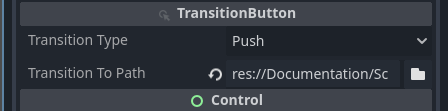

# Menusystem addon for Godot

With nodes added to a normal button in Godot (BaseButton) we can easily create 
transitions between different menus. 

This addon for Godot is written i C#

The demofiles referred to in this documentation can be found in the 
`documentation/scenes` folder.

After some short descriptions of some of the nodes, I will walk you through building
up a gamemenu step by step. 

## Main concepts 
Start by building a main menu as you normally would. With Control-nodes and Button-nodes. 


`MenySystem` uses these buttons to know when to transition by connecting to 
the buttons `Pressed` signals. The button may be any kind of button that 
derives from `BaseButton`. `TransitonButton`, se below, gives these buttons 
extra functionality. 

Globaly, as a autoload/singleton, we have the `MenuController`. 
The `MenuController` supervises all menutransitions, and keep track of all
active menus behind the scene.

### TransitionButton
To the button you want to add a transition to another menu, add 
a `TransitionButton` as a child.


The `TransitionButton` is responsible for connecting to your buttons pressed signal
and holding the settings for the transition. Some settings on the node it
self, as exports, and some as children.

#### Settings


**Transition Type**:
You may choose from, Push; Pop and Switch.
The menus are structured and processed with a `Stackable State Machine`. And in true
`Stack` fashion, Stack adds your menu to the pile and Pop removes it from the pile. Switch
replaces the current menu (at the top of the pile) to the new menu.


**Transition To Path**
Here you enter the path to the menu to transition to. 

	Note: Transitiontype Pop ignores this path.

### Transitions
There are a few built in transitions. 
- InstantTransition
- MoveTransition
- FadeTransition

#### InstantTransition
Instantly transition to the new menu

#### FadeTransition
The screen fades to black, and then fades back to reveal the new menu

- Fade Type: Indicates if you want to fade out, fade in or both. 
- Transition Time: The time, in seconds, ___each___ fade-transition takes. 

#### MoveTransition
The menus moves in a set direction in/out of the screen


- Move Direction: The  direction both menus move over the screen
- Transition Time: The time, in seconds, the full transition takes
- Transition Type and Ease Type: Refer to Godot Tweening CheatSheet

https://raw.githubusercontent.com/godotengine/godot-docs/master/img/tween_cheatsheet.webp

### Have MainMenu display at start
In the `_Ready()` of your start scene:
```csharp
PackedScene packedScene = GD.Load<PackedScene>("res://Documentation/Scenes/MainMenu.tscn");
MenuController.Instance.SetInitialMenu(packedScene);
```

### Transition from the main menu to settings.
1. To the `Exit-button`, add a `TransitionButton` as a child.
1. Have the transition-type remain at `Push`
1. And set the `Transition to path` to point to the settings scene

1. As a child to `TransitionButton` add a `MoveTransition`-node

1. Set `Move direction` to `Left`
1. Keep the default on the rest of the properties.

When you now press `Settings` the current menu moves left of the screen. And at the same
time the `Settings` menu enters from the right. (moving left)

	Note: AboutButton have the same nodes and settings, apart from 
	"Transition to Path" that should point to the About-scene.

### Transition back to the main menu
After we moved to the Settings-menu, `MenuController` have a stack of Menus:
- Settings (Currently active)
- MainMenu 

To go back to the MainMenu we have to use `Pop` as a `TransitionType`. This removes
the top menu (Settings menu) and makes the next menu active (MainMenu).


1. To the `GoBackButton`, add a `TransitionButton` as a child
1. Set the transition-type to `Pop`
1. Leave the `Transition to path` blank. (MenuController already knows where to go)
1. As a child to `TransitionButton` add a `MoveTransition`-node
1. Set `Move direction` to `Right`
1. Keep the default on the rest of the properties 

Note:
	
	The most important setting is the Transition Type to be set to Pop

	The About menu is the same as Settings menu
	
### Fade out and exit

When we press `Exit` button we want to fade out and exit the game.

1. To the `ExitButton`, add a `TransitionButton` as a child
1. The settings of the `TransitionButton` may remain at the default
1. As a child to `TransitionButton` add a `FadeTransition`-node
	
1. Set `Fade Type` to only `Out`
	
1. Leave `Transition Time` at default

	This only fades out and stays at black. To exit the application we need to add a another
	node, `QuitGameTransitionOption`-node.

1. As a child to `TransitionButton` add a `QuitGameTransitionOption`-node
	

When we now run the game and press the `ExitButton`, the screen will fade to black and
then quit the application. 

### Fade out and in to GamePlay
To fade out and in to a new scene is nothing new at this point. So let's do it.

1. To the `PlayButton`, add a `TransitionButton` as a child
1. Have the transition-type set to `Switch`
1. And set the `Transition to path` to point to the GamePlay scene

1. As a child to `TransitionButton` add a `FadeTransition`-node

1. Leave settings at default values

### Start a GameLevel in the background 
When we press `PlayButton` we want to have a game level loaded alongside the menu
part `GamePlay.tscn`. 

1. Add script to the `PlayButton`
1. Add the following to the `PlayButton`-script
    ```csharp
    public partial class PlayButton : Button
    {
        Transition _transitionNode;

        public override void _Ready()
        {
            _transitionNode = this.GetAllChildren<TransitionButton>().FirstOrDefault().TransitionNode;
            _transitionNode.OnPostPageFromTransition += LoadGameLevel;
        }

        public override void _ExitTree()
        {
            _transitionNode.OnPostPageFromTransition -= LoadGameLevel;
        }

        private void LoadGameLevel(Control control)
        {
            GameEvents.StartGame();
        }
    }
    ```
    The `GetAllChildren` method is part of the addon. The node you want is the 
`Transition`-node  (InstantTransition, MoveTransition, FadeTransition, etc).
`TransitionButton` have a reference to the node, `TransitionNode`. 
The `Transition`-node have events we want to use.
1. Create a new script with the name: `GameEvents.cs` with the following content
    ```csharp
    public static class GameEvents
    {
        public static event Action OnGameLevelStart;
        public static event Action OnGameLevelEnd;
        public static event Action OnGamePaused;
        public static event Action OnGameResumed;

        public static void StartGame() => OnGameLevelStart?.Invoke();
        public static void EndGame() => OnGameLevelEnd?.Invoke();
        public static void PauseGame() => OnGamePaused?.Invoke();
        public static void ResumeGame() => OnGameResumed?.Invoke();
    }
    ```
1. Edit the script on the root node of `Game.tscn` (This is our startscene).
    ```csharp
    public partial class Game : Node
    {
        public override void _Ready()
        {
            // Set startscene 
            PackedScene packedScene = GD.Load<PackedScene>("res://Documentation/Scenes/MainMenu.tscn");
            MenuController.Instance.SetInitialMenu(packedScene);

            // Subscribe to when the GameLevelStart
            GameEvents.OnGameLevelStart += GameStart;
        }

        public override void _ExitTree()
        {
            // UnSubscribe to when the GameLevelStart
            GameEvents.OnGameLevelStart -= GameStart;
        }

        private void GameStart()
        {
            PackedScene gameLevel = GD.Load<PackedScene>("res://Documentation/Scenes/GameLevel.tscn");
            Node2D gameInst = gameLevel.Instantiate<Node2D>();
            AddChild(gameInst);
        }
    }
    ```


### Fade back to MainMenu from GamePlay
